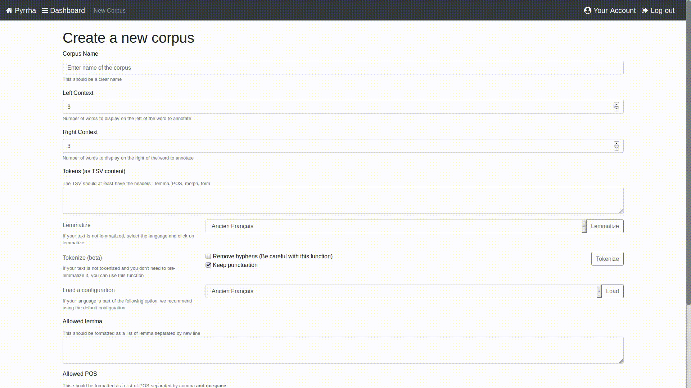
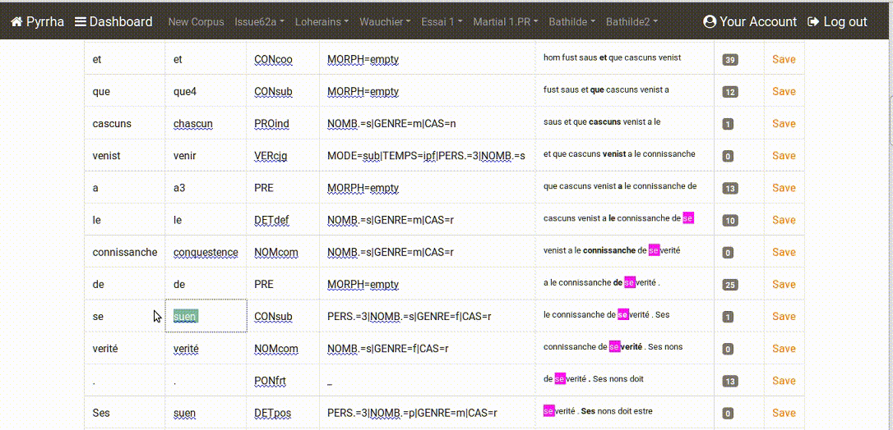
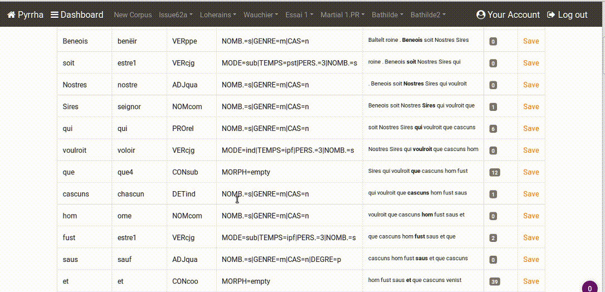
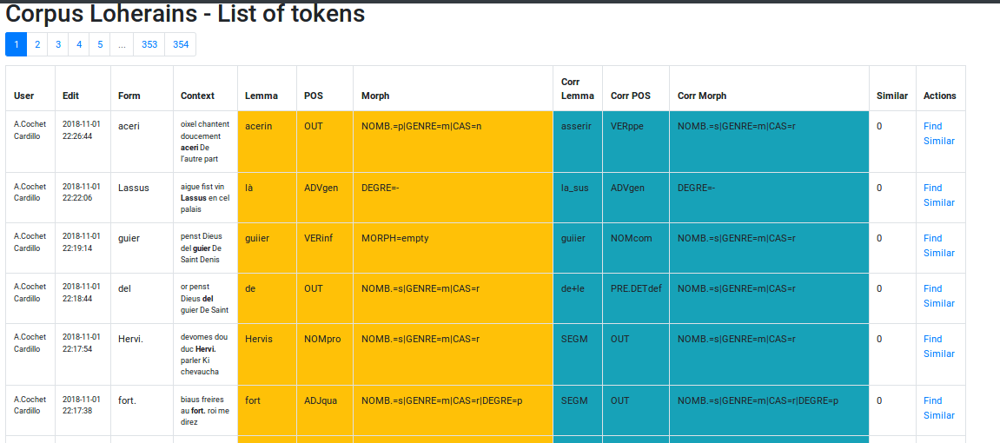
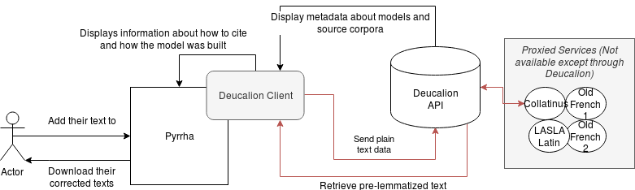
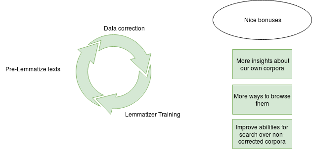

<style type="text/css">
h1, h2, h3, h4 { color:#bd052d!important;}
footer {
	height:70px;
	min-width:302px;
	background-image : url("logo.png");
	background-repeat: no-repeat;
    padding-left:350px;
    line-height:35px;
    font-style:italic;
}
pre { font-size: 0.7em!important; }
</style>
<!-- page_number: true -->
<!-- footer: "Text Encoding: Latinists looking for new synergies ", Thibault Clérice, thibault.clerice@chartes.psl / @ponteineptique-->

Deucalion et Pyrrha
===================

## *Environnement pour la lemmatisation et la post-correction à l'École des chartes*

*Text Encoding: Latinists looking for new synergies*, LASLA, Liège, 8-9 novembre 2018

----

# Le Projet

## Source

- Thèse d'A. Pinche (Lyon 3 et ENC) et travail de J.-B. Camps (ENC) sur  des textes en Ancien Français.
- Besoin d'accélération du travail de lemmatisation pour des besoins de recherches
	- Création d'index pour une édition nativement numérique
	- Recherche quantitative (notamment sur la variation orthographique)
- À l'origine, utilisation d'un lemmatiseur, puis passage à Excel pour la correction, puis retour au XML.

---

# Premiers développements

*Pandora Post-Correct App* (ou PPA) qui va devenir Pyrrha dans les prochains mois. Open-Source pour le logiciel, aucune obligation quant aux données : https://github.com/hipster-philology/pandora-postcorrect-app

## Objectifs :

1. Simplifier la correction sérielle : quand on corrige `Martins` vers le lemme `Martin`, **proposition** d'application de la correction à d'autres cas similaires
2. Historique des modifications
3. Listes de contrôle fournies par l'utilisateur-rice.

---

# Exemple d'utilisation simple

1. L'utilisateur-rice donne des données généralement pré-lemmatisées suivant la forme 

```csv
form	lemma	morph	POS
Ch’est	chëoir	NOMB.=s|GENRE=m|CAS=r	VERcjg
le	le	NOMB.=s|GENRE=m|CAS=r	DETdef
vie	vie1	NOMB.=s|GENRE=f|CAS=r	NOMcom
de	de	MORPH=empty	PRE
sainte	saint1	NOMB.=s|GENRE=f|CAS=r|DEGRE=p	ADJqua
Baltelt	bataille	NOMB.=s|GENRE=f|CAS=r	NOMcom
```

Puis se rend sur une instance de type dev.chartes.psl.eu/ppa

---

# Exemple d'utilisation simple : Création

[](https://imgur.com/a/kiGerAD)

---

# Exemple d'utilisation simple : Modification

[](https://imgur.com/a/fKgI4ix)

---

# Exemple d'utilisation simple : Recherche d'incohérences

[](https://imgur.com/a/2X2sGBV)

---

# Exemple d'utilisation simple : Historique



---

# Deucalion

http://github.com/hipster-philology/deucalion

## Problématiques

- Lemmatiseur = travail important de développement informatique ET d'annotation/travail philologique.
- Lemmatiseurs ont des interfaces différentes

## Objectifs non-couverts

Deucalion **n'est pas** un service de lemmatisation massive. Il est prévu principalement pour une utilisation en lien avec Pyrrha/PPA afin d'accélerer le travail de l'annotateur-rice.

---

# Deucalion :Modèle actuel (non définitif)

```json
"@id":"http://127.0.0.1:5005/model/enc-001",
"dc:creator":[{ "@id":"https://viaf.org/viaf/134649805/",
      "@label":"Ecole nationale des Chartes"}],
"dc:description":["Model built on Wauchier de Denain, Graal 
					and Old French data"],
"dc:language":"fro",
"dc:source":[{
      "dc:alternative":"Ariane Pinche, \"Li Seint Confessors, Édition 
      nativement numérique\". 2018-10-23, Available at 
      http://chartes.psl.eu/corpora/Wauchier",
      "dc:authors":[{
            "@id":"http://chartes.psl.eu/apinche",
            "@label":"Ariane Pinche"
         }],
      "dc:date":"2018-10-23",
      "dc:title":"Li Seint Confessors, \u00c9dition nativement num\u00e9rique"
   }
],
"title":"Model for Ancient-French"
}
```

---

# Ce qu'il manque

- Une description fine du logiciel utilisé. Une propriété générale de citation (comme `dc:alternative` pour les Sources ?)
- Un client, afin de montrer automatiquement à l'utilisateur-rice les modèles et outils disponibles, mais aussi comment les citer (contrairement à la situation actuelle "Ancien Français").
- Information sur les financeurs (moins important pour certains pays que d'autres.)

---

# L'architecture



---

# À Implémenter

- Amélioration des performance de l'application [Issue 64](https://github.com/hipster-philology/pandora-postcorrect-app/issues/64)
- *Inter-Corrector Agreement* [Issue 61](https://github.com/hipster-philology/pandora-postcorrect-app/issues/61)
- Afficher un identifiant ou numéro d'ordre des mots [Issue 69](https://github.com/hipster-philology/pandora-postcorrect-app/issues/69)
- Ajout de colonnes au choix de l'utilisateur-rice [Issue 13](https://github.com/hipster-philology/pandora-postcorrect-app/issues/13)
- Consistency Check POS / Morph [Issue 25](https://github.com/hipster-philology/pandora-postcorrect-app/issues/15)
- Statut vérifié [Issue 29](https://github.com/hipster-philology/pandora-postcorrect-app/issues/29)

---

# En définitif



---

# Merci

Liens : 
- http://github.com/hipster-philology/deucalion
- https://github.com/hipster-philology/pandora-postcorrect-app
- https://github.com/PonteIneptique/deucalion-model-af
